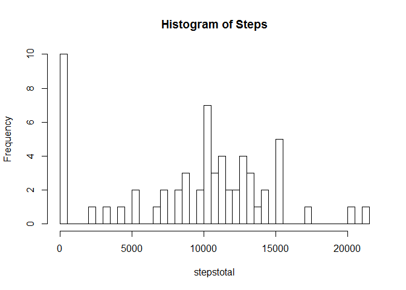

# Reproducible Research - Project 1
Timothy  
May 19, 2016  

# Reproducible research peer assessment 1

Load in the data.


```r
data <- read.csv("activity/activity.csv")
```

##What is the mean total number of steps taken per day?

We are to ignore missing values, i.e. NAs. Thus, where appropriate, na.rm will be set to **TRUE**


First, we use tapply() to obtaint the total number of steps for each day.
This new set of numbers can then by graphed in a histogram and we can use mean() and median() to get those respective statistics.

```r
stepstotal <- tapply(data$steps, data$date, sum, na.rm=TRUE)
hist(stepstotal,breaks=50,main = "Histogram of Steps")
```

<!-- -->


```r
mean(stepstotal)
```

```
## [1] 9354.23
```

```r
median(stepstotal)
```

```
## [1] 10395
```
The mean is 9354.2295082
The median is 10395

##What is the average daily pattern?


```r
stepsinterval <- aggregate(steps ~ interval, data = data, FUN = mean, na.rm=TRUE)
head(stepsinterval)
```

```
##   interval     steps
## 1        0 1.7169811
## 2        5 0.3396226
## 3       10 0.1320755
## 4       15 0.1509434
## 5       20 0.0754717
## 6       25 2.0943396
```

```r
plot(stepsinterval, type="l", main = "Average steps by interval", xlab ="5 minute interval", ylab = "Average steps across days")
```

<!-- -->


```r
maxsteps <- max(stepsinterval$steps)
interval <- stepsinterval$interval[stepsinterval$steps==maxsteps]
```

The maximum number of steps is 206.1698113 and occurss during the 835 interval.

###Imputing missing values

The number of NAs in the dataset:


```r
length(data$steps[data$steps == "NA"])
```

```
## [1] 2304
```

Fill in the NAs with the mean, and there is a handy function to impute called **impute()** in the package Hmisc

```r
library(Hmisc)
```

```
## Loading required package: lattice
```

```
## Loading required package: survival
```

```
## Loading required package: Formula
```

```
## Loading required package: ggplot2
```

```
## 
## Attaching package: 'Hmisc'
```

```
## The following objects are masked from 'package:base':
## 
##     format.pval, round.POSIXt, trunc.POSIXt, units
```

```r
dataimpute <- data
dataimpute$steps <- impute(dataimpute$steps, fun=mean)
```
Make a histogram of total number of steps per day, report the mean and median.

```r
totalstepsimputed <- tapply(dataimpute$steps, dataimpute$date, sum)
hist(totalstepsimputed,breaks=50, main = "Histogram of Steps in imputed data")
```

<!-- -->


```r
meanimputed <- mean(totalstepsimputed)
medianimputed <- median(totalstepsimputed)
```
The mean is 1.0766189\times 10^{4} and the median is 1.0766189\times 10^{4}
DO THEY DIFFER? WHAT IS THE IMPACT?

Yes, these differ from the originial values - mean and median are now the same, and have increased.

##Are there differences in activity patterns between weekdays and weekends?

```r
dataimpute$days <- weekdays(as.Date(dataimpute$date, format = "%Y-%m-%d"))

dataimpute$daytype <- ifelse(dataimpute$days== "Sunday" | dataimpute$days == "Saturday", "weekend", "weekday")
dataimpute$daytype <- as.factor(dataimpute$daytype)
```


```r
meanfinal <- aggregate(steps ~ interval + daytype, data = dataimpute, mean)
library(lattice)
xyplot(steps~interval|daytype, data=meanfinal, xlab="INTERVAL", ylab="NUMBER OF STEPS", type="l", layout=c(1,2))
```

<!-- -->
